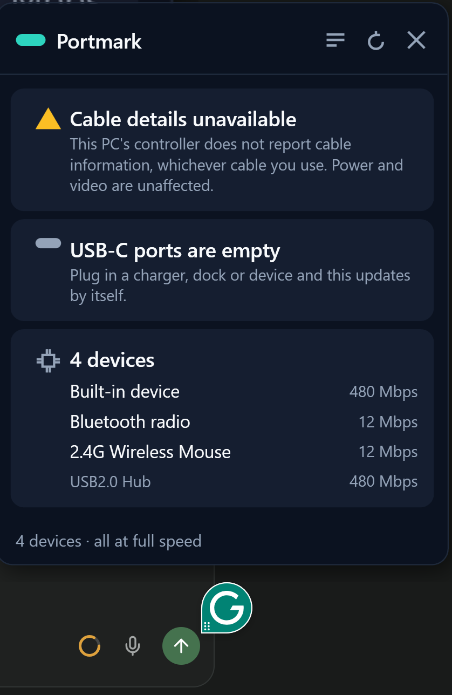

# portmark

[](https://github.com/dbhq-uk/portmark/actions/workflows/ci.yml)
[](LICENSE)
[](#install)
[](#building)
[](#building)

**A USB-C cable, charger and port checker for Windows. Find out what your cable, charger and
adapter can actually do, why your laptop charges slowly, and get told "unknown" when your PC
genuinely cannot tell you.**

*A native Windows CLI for USB-C: USB Power Delivery contracts, charging diagnosis, DisplayPort
Alternate Mode, e-marker cable data, and connected device details. No Electron, no telemetry,
single executable. Plus a tray app that watches your ports and tells you at the moment you plug
something in.*

<p align="center"></p>

USB-C connectors are identical and their capabilities are not. One charger delivers 5W, another
65W. One adapter carries video, another cannot. Windows negotiates all of this on every connection
and then shows you almost none of it. portmark reads it back out.

```
$ portmark --human

Port 1
  Alt modes    Lenovo vendor mode, Intel Thunderbolt 3, DisplayPort Alternate Mode
  Negotiated   5V at 3A (15W)
  Charging     nominal charging rate, according to the controller
  Supply offers
    - 5V at 3A (15W)
    - 9V at 3A (27W)
    - 15V at 3A (45W)
    - 20V at 5A (100W)

  ** CONTRACT FAR BELOW WHAT THIS SUPPLY OFFERS **
  A 15W contract is in force, but this supply offers up to 100W. The
  controller nonetheless reports a nominal charging rate, so its firmware
  is not treating this as a shortfall. The battery is at 30 percent, so a
  full battery does not explain this, though a charge limit could.
  Cable rating at least 5A, deduced not reported
```

A 100W charger, a laptop taking 15W of it, and a battery falling while Windows says "charging".
That reading is from the machine portmark was developed on, cut to the relevant lines.

## Why is my USB-C device running slowly?

The question behind most USB-C frustration is not "what is this cable" but "why is this slow".
portmark compares what the hub reports a device is capable of against the link it actually
negotiated, and says what the hub reports about the port and its connector. For example, a USB 3
drive on a USB 2.0 cable reads along these lines:

```
Portable SSD
  Speed        High, 480 Mbps

  ** RUNNING SLOWER THAN IT COULD **
  Running at 480 Mbps, but the hub reports this device is SuperSpeed capable,
  which is 5 Gbps or above. The hub reports this port number supports USB 1.1
  and USB 2.0, and that its connector is shared with companion port 2, which
  supports USB 3. Something between the device and the connector, such as a
  cable or adapter without USB 3 support, would produce this, but nothing read
  here identifies what is limiting it.
```

Every part of that comes from the hardware: the hub's capability flags for the device (or the
device's own BOS descriptor), the negotiated speed, and the port's supported protocols and
companion port. A device's declared USB version is not used, because a USB 2.0 mouse running at
12 Mbps is working exactly as designed. Windows knows all of this and never tells you.

## Why is my laptop charging slowly over USB-C?

The same comparison works for charging. portmark reads what the supply offers and the contract
actually in force, and tells you when most of the offer is going unused:

```
Port 1
  Negotiated   5V at 3A (15W)
  Charging     nominal charging rate, according to the controller
  Supply offers
    - 20V at 5A (100W)

  ** CONTRACT FAR BELOW WHAT THIS SUPPLY OFFERS **
  A 15W contract is in force, but this supply offers up to 100W. The controller
  nonetheless reports a nominal charging rate, so its firmware is not treating this
  as a shortfall. The battery is at 43 percent, so a full battery does not explain
  this, though a charge limit could.
```

That is a real reading from the machine portmark was developed on, cut to the relevant lines: the
full output lists all four supply offers and goes on to what the reading cannot tell. It matters because
everything else on that machine said the opposite. Windows reported the battery as charging while
it fell from 46 percent to 43 percent. The port controller reported a nominal charging rate
throughout. The battery charge is read for one reason: a nearly full battery draws very little and
that is correct, so without it the honest answer would have to include an excuse that did not
apply.

portmark names no cause. It reports the gap, what the controller thinks of it, and what the
evidence cannot tell. A supply advertising 100W is not proof that it can deliver 100W.

Where the battery reports it, portmark also shows the battery's own charge or discharge rate, and
says so when a battery is losing charge on external power. That is the battery's flow, not the
power arriving through the cable, and it is labelled that way.

## Why you cannot just look at the connector

Two USB-C cables can be physically identical and differ by a factor of twenty in power and eighty
in data rate. The plug tells you nothing. Windows negotiates the real answer on every connection,
uses it internally, and never shows you. portmark surfaces it.

## The rule this project is built on

**Nothing is ever inferred from the shape of a connector.** A USB-C socket tells you the shape of
the socket and nothing else.

When a field cannot be determined, portmark says so and says why. It will tell you "this PC's port
controller does not report cable information" rather than "this cable has no e-marker", because
those are different claims and only one of them is supported by the evidence. Fields that were not
reported are `null` in the JSON, never zero, never a plausible-looking default.

This costs the tool some confident-sounding output. That is the point.

## Two tiers

portmark reads from two independent sources. The first needs nothing at all.

| Tier | Requires | Tells you |
|---|---|---|
| **Zero setup** | nothing - works on first run | Every attached USB device, read from its own descriptors, with the registered name of each vendor ID. Alternate modes by SVID, whether **DisplayPort is currently active**, whether anything is **running slower than it could**, and the battery's own charge, rate and health. |
| **Extended** | a one-time administrator step | Port state and partner, power direction, the negotiated PD contract, the supply's voltage/current offers (up to seven standard-range objects), and cable e-marker data *where the controller supports it*. |

Most of what people want is in the first tier. You can ignore the second entirely.

`portmark usb4` sits outside both tiers. It reads the USB4 drivers' trace events, which needs
administrator rights every time it runs, and it only has something to report while a USB4 link is
up.

## Install

Download from [Releases](../../releases). Both are single self-contained executables with no
installer and no runtime to install.

- `portmark.exe` - the CLI
- `PortmarkTray.exe` - the tray app: live notifications when devices arrive, a panel on click,
  and an optional Start with Windows toggle in its tray menu

```powershell
portmark --human      # plain English
portmark              # JSON
```

## Usage

```
portmark                 read all ports, print JSON
portmark --human         read all ports, print plain English
portmark usb             list every attached USB device from its own descriptors
portmark tree            show attached devices as the tree they physically form
portmark billboard       report alternate modes and video capability
portmark power           compare what devices asked for against what each hub can supply
portmark watch           report devices arriving and leaving as it happens
portmark battery         read the batteries' own charge, rate and health
portmark battery --sample SECONDS
                         average the battery's net charge flow over an interval
portmark usb4            what Windows' USB4 drivers report: links, speed, tunnels (admin)
portmark usb4 --from F   decode a saved tracerpt XML file instead (no admin)
portmark report          write one file to attach to a hardware report (nothing is sent)
portmark enable          one-time administrator setup for the extended tier
portmark disable         undo it
```

Exit codes: `0` read successfully, `1` error, `2` a one-time setup step is needed, `3` this PC
cannot report this data.

The JSON is the contract. It is camelCase, includes the raw bytes and CCI values for every
response so you can check or redo the decoding yourself, and carries a `schemaVersion`.

```powershell
portmark | ConvertFrom-Json | Select-Object -ExpandProperty connectors
```

## The extended tier, and its cost

The extended tier needs one registry value set, once, as administrator. **You should understand
what it does before running it.**

Windows exposes port controller data through an interface that ships switched off, and Microsoft
says why: to stop it "being accessible to unauthorized users on a retail system". While it is on,
**any program running as you can send commands to your USB-C power controller**, not just portmark.

portmark itself only ever reads. It sends no command that changes port state - no role swaps, no
resets, no power renegotiation - and there is no code path that could. But enabling the interface
does not only enable portmark.

`portmark disable` turns it back off, and is worth running when you are done.

## What portmark cannot tell you

Being specific about this matters more than the feature list.

- **Cable e-marker data depends entirely on your PC's controller.** Many controllers do not
  advertise `CableDetailsAvailable`, and when they do not, no software on any operating system can
  read the cable's e-marker through them. portmark checks that capability bit and tells you plainly
  rather than blaming your cable. One thing survives even then: if the attached supply offers more
  than 3A, the cable must be able to carry it, because a supply reads the cable before offering
  that much. portmark reports that as a deduction, labelled as one, and never as something the
  cable said.
- **Video is reported from Billboard descriptors, not guessed.** If an adapter exposes no Billboard
  device, video capability is reported as unknown. An adapter without one is not an adapter without
  video.
- **UCSI carries no video field.** Any tool telling you a *cable* does or does not carry video from
  UCSI alone is guessing.
- **The battery rate is the battery's own measurement.** It is not charger or cable power. Some
  batteries report zero while charging, or only report a rate while discharging, and portmark says
  when a reading is not usable rather than presenting it.
- **USB4 link data needs a live USB4 link.** With nothing on the USB4 port the domain is powered
  down, its registers read zero, and portmark reports that there is no link rather than drawing any
  conclusion about a cable.
- **Roughly a third of machines will return little or nothing.** portmark detects this on first run
  and says so, rather than showing you a blank panel or a confident wrong answer.

## Frequently asked

**Does this work on Windows 10?**
The zero-setup tier does. The extended tier needs a UCSI 2.x capable build, which means Windows 11
22H2 September Update or later. portmark degrades rather than failing.

**Why does it say my cable is "not reported" when I know it is a 100W cable?**
Almost certainly because your PC's port controller does not advertise `CableDetailsAvailable`. The
cable is fine; the controller will not describe it. `portmark --human` says which case you are in.
If a supply offering more than 3A is attached, portmark will still tell you the cable carries at
least that much, deduced from the power contract rather than read from the cable.

**Is my USB-C cable really 100W?**
A cable rated above 3A has to carry an e-marker chip that says so. If your PC's controller can read
it, portmark shows the cable's own rating. If it cannot, and a supply offering more than 3A is
attached, portmark tells you the cable carries at least that much, labelled as a deduction. A
cable that is fine at 100W can still be a USB 2.0 cable: power and data speed are separate.

**Will this USB-C cable or adapter carry video?**
portmark shows which alternate modes each port supports, which the attached device offers, and,
from an adapter's Billboard descriptor, whether DisplayPort was actually entered. UCSI has no
video field for cables, so portmark will not claim a cable carries video when nothing says so.

**Is there a WhatCable for Windows?**
WhatCable is a macOS app that answers the same question on a Mac. portmark is a separate,
independent Windows tool written against the USB specifications. It is not a port of WhatCable and
is not affiliated with it.

**Is it safe? It wants administrator rights.**
Only for the optional extended tier, only once, and only to set a single registry value. portmark
never sends a command that changes port state. Read [the cost of the extended tier](#the-extended-tier-and-its-cost)
before deciding - the honest answer is that enabling it has a real trade-off.

**Does it phone home?**
No. No telemetry, no network calls, no analytics. It is a single executable that reads your
hardware and prints the result. `portmark report` writes a file for you to share if you choose; it
never uploads anything, and it removes serial numbers, device paths and your user and machine names
unless you pass `--no-redact`.

## Hardware coverage

Verified on a Lenovo ThinkPad T16 Gen 2 (AMD, type 21K7, BIOS R2FET70W) running Windows 11 25H2.
On that machine the power delivery decoding was checked against physical reality: the attached
supply decodes to 5V/3A, 9V/3A, 15V/3A and 20V/3.25A, exactly the profile printed on the 65W
charger. The alternate mode list was checked against the machine too: the USB4 port lists
Lenovo's vendor mode, Thunderbolt 3 and DisplayPort, and the USB 3.2 port lists Lenovo's vendor
mode and DisplayPort, matching the spec sheet.
That controller does not report cable details: it answers `GET_CABLE_PROPERTY` with UCSI's
Not Supported indicator, exactly as it answers an undefined command.

That is one machine. **If you run portmark, please run `portmark report` and attach the file it
writes to a [hardware report](../../issues/new?template=hardware-report.yml)** - particularly
whether your controller reports cable details. That capability
is not documented anywhere and the only way to find out how common it is, is to collect it.

## Contributing

The most valuable contribution is a [hardware report](../../issues/new?template=hardware-report.yml):
whether your PC's controller reports cable details is undocumented, and collecting it is the only
way to find out how common it is. See [CONTRIBUTING.md](CONTRIBUTING.md).

## Building

```powershell
dotnet publish src/Portmark.Cli -c Release
dotnet test Portmark.slnx
```

Requires the .NET 10 SDK. The tests run on captured hardware byte vectors and need no USB-C device
attached.

## How this was built

portmark was written against the USB-IF UCSI specification, the USB Power Delivery specification,
the USB Billboard Device Class specification, Microsoft Learn documentation (including the battery
class and USB4 trace event references), and direct observation of the Windows driver stack. Vendor
names come from The USB ID Repository, used under its BSD licence; see
[THIRD-PARTY-NOTICES.md](THIRD-PARTY-NOTICES.md). The reverse
engineering that made it possible - including recovering the in-box UCSI interface GUID and control
codes, which differ from the ones in Microsoft's published samples - is documented in
[docs/SPIKE.md](docs/SPIKE.md), along with what could not be established and why.

portmark is not affiliated with, derived from, or endorsed by any other USB-C inspection tool.

## Licence

MIT. See [LICENSE](LICENSE).
